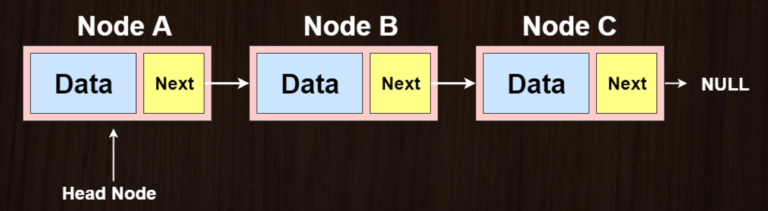

# The Linked List Data Structure!

### **What is a Linked List?**

- _Linear Data Structure_ in which elements are not stored at contiguous memory locations.
- The elements within a Linked List are linked together using pointers.
- Linked Lists consist of Nodes, where each Node contains a data field and reference links to the next Node (and in some cases the previous Node).

### **Types of Linked Lists:**
- Singly Linked Lists
- Doubly Linked Lists
- Circular Linked Lists



### **Possible Applications:**

- Can be used to implement Stacks, Queues, and even Graphs.
- Maintaining a directory of values
- Could be used in a media player to keep track of order of media elements.

### **Operations:**

#### checkIfNodeExists()

- Traverses through the Linked List to determine if a Node with a given key exists.

#### append()

- Items are added to the tail end of the Linked List.
- Because elements are not stored in contiguous memory, there is no need to resize the Linked List like you would have to with an array.

#### prepend()

- Items are added to the head end of the Linked List.

#### insert()

- Items are added into the middle of the Linked List, after a specified element.

#### delete()

- Remove an item from the Linked List.

#### update()

- Update the data for a given Node within the Linked List.

#### print()

- Display all the items in the Linked List.


### **Implementation of a Doubly Linked List (C++):**

##### We must first define a Node class that will store all of the Node links within the Linked List. Each Node object has an integer key, an integer data, and two pointers that link the previous and next Node.

- Note: This implementation stores data members as public variables to reduce the number of methods needed.

```c++
class Node
{
    private:
       
    public:
        int key;
        int data;
        Node* next;
        Node* prev;

        Node()
        {
            key = 0;
            data = 0;
            next = prev = NULL;
        }

        Node(int k, int d)
        {
            key = k;
            data = d;
            next = prev = NULL;
        }
};
```

##### Now we can create the Linked List class. There is one public data member (head) that points to the current head Node of the Linked List.

- Note: This implementation stores data members as public variables to reduce the number of methods needed.

```c++
class LinkedList
{
    private:

    public:
        Node* head;

        LinkedList()
        {
            head = NULL;
        }

        LinkedList(Node *n)
        {
            head = n;
        }
};
```

##### checkifNodeExists() public method implementation

```c++
 // Return address of Node 
Node* checkIfNodeExists(int k)
{
    Node* temp = NULL;
    Node* ptr = head;

    while (ptr != NULL)
    {
        if (ptr->key == k)
        {
            temp = ptr;
        }
        ptr = ptr->next;
    }
    return temp;
}
```

##### append() public method implementation

```c++
 // Append a Node to the tail end of the Linked List
void appendNode(Node* n)
{
    if (checkIfNodeExists(n->key) != NULL)
    {
        cout << "Node already exists with key: " << n->key << endl;
        cout << "Enter a different key value to append to the Linked List! " << endl;
    }
    else 
    {
        if (head == NULL)
        {
            head = n;
            cout << "Node appended to Head of Linked List" << endl;
        }
        else 
        {
            Node* ptr = head;
            while (ptr->next != NULL)
            {
                ptr = ptr->next;
            }
            ptr->next = n;
            n->prev = ptr;
            cout << "Node appended to end of Linked List" << endl;
        }
    }
}
```

##### prepend() public method implementation

```c++
// Add Node to the head of the Linked List
void prependNode(Node* n)
{
    if (checkIfNodeExists(n->key) != NULL)
    {
        cout << "Node already exists with key: " << n->key << endl;
        cout << "Enter a different key value to prepend to the Linked List! " << endl;
    }
    else
    {
        if (head == NULL)
        {
            head = n;
            cout << "Node prepended to Head of Linked List" << endl;
        }
        else 
        {
            head->prev = n;
            n->next = head;
            head = n;

            cout << "Node prepended to the start of Linked List" << endl;
        }
    }
}
```

##### insert() public method implementation

```c++
 // Insert Node into the middle of the List after a given value
void insertNodeIntoList(Node* n, int k)
{
    Node* ptr = checkIfNodeExists(k);
    if (ptr == NULL)
    {
        cout << "No Node exists with key value: " << k << endl;
    }
    else 
    {
        if (checkIfNodeExists(n->key) != NULL)
        {
            cout << "Node already exists with key: " << n->key << endl;
            cout << "Enter a different key value to insert into the Linked List! " << endl;
        }
        else 
        {
            Node *nextNode = ptr->next;
            if (nextNode == NULL)
            {
                n->prev = ptr;
                ptr->next = n;
                cout << "Inserted Node at end of Linked List" << endl;
            }
            else 
            {
                n->next = nextNode;
                n->prev = ptr;
                nextNode->prev = n;
                ptr->next = n;
                cout << "Inserted Node in middle of Linked List" << endl;

            }
        }
    }
}
```

##### delete() public method implementation

```c++
void deleteNodeByKey(int k)
{
    Node* ptr = checkIfNodeExists(k);
    if (ptr == NULL)
    {
        cout << "No Node exists with key value: " << k << endl;
    }
    else 
    {
        // Check if Key is stored in the head Node
        if (head->key == k)
        {
            head = head->next;
            cout << "Node Deleted with the key value: " << k << endl;
        }
        else
        {
            Node *nextNode = ptr->next;
            Node *prevNode = ptr->prev;

            if (nextNode == NULL)
            {
                prevNode->next = NULL;
                cout << "Node deleted at the end of the Linked List" << endl;
            }
            else 
            {
                prevNode->next = nextNode;
                nextNode->prev = prevNode;
                cout << "Node Deleted in the middle of the Linked List" << endl;
            }
        }
    }
}
```

##### update() public method implementation
```c++
void updateNodeByKey(int k, int d)
{
    Node* ptr = checkIfNodeExists(k);
    if (ptr != NULL)
    {
        ptr->data = d;
        cout << "Node Data Updated Successfully" << endl;
    }
    else 
    {
        cout << "Node Does not exist with that key value" << endl;
    }
}
```

##### print() public method implementation

```c++
 void printLinkedList()
{
    if (head == NULL)
    {
        cout << "No Nodes in the Linked List!" << endl;
    }
    else
    {
        cout << "The values in the Linked List are: " << endl;
        Node* temp = head;
        while (temp != NULL)
        {
            cout << "(" <<temp->key <<", " << temp->data << ")" << "<-->";
            temp = temp->next;
        }
        cout << endl;
        cout << "----------------------------------------------" << endl;
    }
}
```
