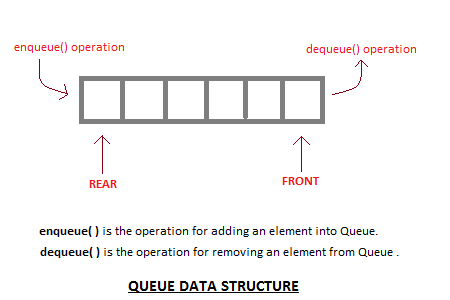

# The Queue Data Structure!


### **What is a Queue?**

- _Linear Data Structure_ that operates in a First in First Out (FIFO) manner.
- Behaves like a real-world queue or line.
- Allows for adding/removing elements in a particular order.

### **Possible Applications:**

- CPU scheduling, Disk scheduling.
- When data is transferred asynchronously, a queue is used to keep order synchronized.
- Call center phone systems will uses queues to hold people in the order they called.

### **Operations:**



#### enqueue()

- Items are added to the back of the queue.
- If there is no space for additional items, then the queue is in _overflow state_

#### dequeue()

- Items are removed from the front of the queue.
- The removed item is returned to the program.
- If the queue is empty (no items can be removed), then the stack is in _overflow state_.

#### isEmpty()

- Tells if the queue is empty or not.

#### isFull()

- Tells if the queue is full or not.

#### count()

- Get the number of items in the queue.

#### display()

- Display all the items in the queue.

### **Implementation (C++):**

##### We define a Queue class that will store all of member variables and methods to properly implement the data structure.

- Note: This implementation utilizes an array as the underlying abstract data type.

```c++
class Queue {
   private:
    int* queue;
    int rear;
    int front;
    int capacity;

   public:
    Queue(int c)
    {
        front = 0;
        rear = 0;
        capacity = c;
        queue = new int;
    }

    ~Queue()
    {
        delete[] queue;
    }
}
```

##### isEmpty() public method implementation

```c++
   bool isEmpty()
    {
        if (front == 0 && rear == 0)
        {
        return true;
        }
        else
        {
        return false;
        }
    }
```

##### isFull() public method implementation

```c++
 bool isFull()
    {
        if (rear == capacity)
        {
        return true;
        }
        else
        {
        return false;
        }
    }
```

##### enqueue() public method implementation

```c++
 void enqueue(int val)
    {
        if (isFull())
        {
        cout << "Queue is Full! " << endl;
        return;
        }
        else
        {
        queue[rear] = val;
        rear++;
        }
    }
```

##### dequeue() public method implementation

```c++
int dequeue()
    {
        int x;
        if (isEmpty())
        {
        cout << "Queue is Empty! " << endl;
        return 0;
        }
        else
        {
        x = queue[0];
        for (int i = 0; i < rear -1; i++)
        {
            queue[i] = queue[i + 1];
        }
        rear--;
        }
        return x;
    }
```

##### count() public method implementation

```c++
int count()
    {
        return (rear - front) + 1;
    }
```

##### display() public method implementation

```c++
void display()
    {
            if (isEmpty())
        {
            cout << "Queue is Empty! " << endl;
            return;
        }
        cout << "The values in the Queue are: " << endl;
        for (int i = front; i < rear; i++)
        {
            cout << queue[i] << " ";
        }
        cout << endl;
    }
```
