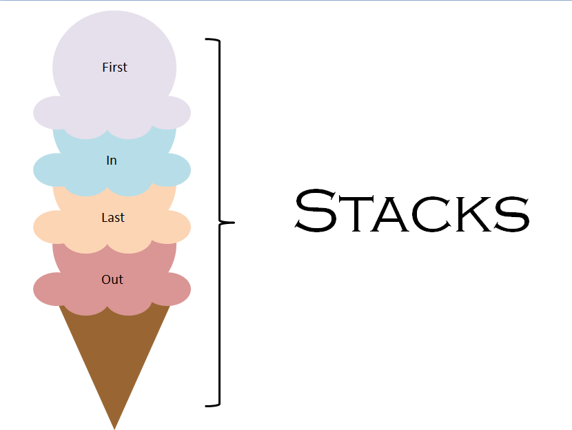

# The Stack Data Structure!

### **What is a Stack?**

- _Linear Data Structure_ that operates in a Last in First Out (LIFO) pattern.
- Behaves like a real-world stack of books
- Allows for adding/removing elements in a particular order.

### **Possible Applications:**

- Balance symbols (ie. curly braces).
- Undo/Redo functionality in editors.
- Forward/Backward functionality and cache memory storage in web browsers.
- Used in Depth-First-Search for graph algorithms.



### **Operations:**

#### Push()

- Items are added to the top of the stack.
- If there is no space for additional items, then the stack is in _overflow state_

#### Pop()

- Items are removed from the top of the stack.
- The removed item is returned to the program.
- If the stack is empty (no items can be removed), then the stack is in _overflow state_.

#### isEmpty()

- Tells if the stack is empty or not.

#### isFull()

- Tells if the stack is full or not.

#### peek()

- Access the item at given position, without changing items in stack.

#### count()

- Get the number of items in the stack.

#### change()

- Change the item at a given position in the stack.

#### display()

- Display all the items in the stack.

### **Implementation (C++):**

##### We define a Stack class that will store all of member variables and methods to properly implement the data structure.

- Note: This implementation utilizes an array as the underlying abstract data type.

```c++
class Stack {
    private:
        int top;
        int arr[5];

    public:
        Stack()
        {
            top = -1;
            for (int i = 0; i < 5; i++)
            {
                arr[i] = 0;
            }
        }
};
```

##### isEmpty() public method implementation

```c++
 bool isEmpty()
    {
        if (top == -1)
            return true;
        else
            return false;
    }
```

##### isFull() public method implementation

```c++
 bool isFull()
    {
        if (top == 4)
            return true;
        else
            return false;
    }
```

##### push() public method implementation

```c++
void push(int val)
    {
        if (isFull())
        {
            cout << "Error: Stack Overflow. The Stack is currently Full!";
        }
        else
        {
            top++;
            arr[top] = val;
        }
    }
```

##### pop() public method implementation

```c++
int pop()
    {
        if (isEmpty())
        {
            cout << "Error: Stack Overflow. The Stack is currently Empty!";
            return 0;
        }
        else
        {
            int popValue = arr[top];
            arr[top] = 0;
            top--;
            return popValue;
        }
    }
```

##### count() public method implementation

```c++
int count()
    {
        return (top + 1);
    }
```

##### count() public method implementation

```c++
int count()
    {
        return (top + 1);
    }
```

##### change() public method implementation

```c++
void change(int pos, int val)
    {
        arr[pos] = val;
    }
```

##### peek() public method implementation

```c++
int peek(int pos)
    {
        if (isEmpty())
        {
            cout << "Error: Stack Overflow. The Stack is currently Empty!";
        }
        else
        {
            return arr[pos];
        }
    }
```

##### display() public method implementation

```c++
 void display()
    {
        cout << "The values in the Stack are: " << endl;
        for (int i = 4; i >= 0; i--)
        {
            cout << arr[i] << endl;
        }
    }
```
